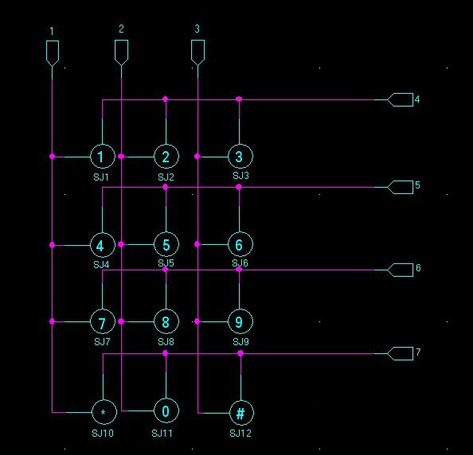

# Design Decisions

This document outlines the major design decisions made by out team during the development of the Smart Deadbolt Lock Project.

---

## Table of Contents
1. Overview
2. High Level Design
3. Hardware Design
4. Software Design
5. Enclosure

---

## 1. Overview
This project is a smart deadbolt lock that provides secure access control, and is built around an Arduino microcontroller to enable access via a keypad and RFID reader. Our team aimed to design a cost-effective, reliable and user-friendly locking mechanism suitable for residential use.

---

## 2. High Level Design

**Block Diagram**

**Decision:** Incorporating RFID 

**Reasoning:** Convenient and safe security measure for modular locking and unlocking system

**Decision:** Incorporating Keypad

**Reasoning:** Efficient alternative to RFID if user doesn't have proper RFID credentials

**Decision:** Incorporating GUI

**Reasoning:** Efficient method of interaction between user and modular system

---

## 3. Hardware Design

**Decision:** Using Arduino Mega microcrontoller

**Reasoning:** Provides sufficient amount of i/o pins, effective physical size for design

**Decision:** 3x4 Matrix Number Pad

**Reasoning:** Provides a robust design, less i/o pins required compared to others, numbers & 2 symbols only https://www.adafruit.com/product/3845

**Decision:** 16x2 LCD Display

**Reasoning:** Cheap and effective way of presenting GUI, takes 16 pins on microcontroller
https://www.vishay.com/docs/37484/lcd016n002bcfhet.pdf

**Decision:** RC522 RFID Module

**Reasoning:** Cheapest option for RFID incorporation, considered using 5V RFID options, since rest of board runs at 5V, significantly more expensive than RC522, will find workaround to compensate

**Decision:** Common Anode RGB LED

**Reasoning:** Decided to go with an RGB LED instead of 2+ individual LEDs since it takes up less pins, can add additional status indications as well

---

## 4. Software Design

**Decision:** Using Arduino IDE to program microcontroller

**Reasoning:** Simplest and most universal way to program microcontroller

**Decision:** Keypad Library for Arduino IDE

**Reasoning:** Preset Keypad Library created to program Adafruit Keypad 
https://learn.adafruit.com/matrix-keypad/arduino#install-keypad-library-3060387

---

## 5. Enclosure 

**Decision:** Made prototype enclosure from using wood-laser cutting 

**Reasoning:** Robust/sturdy enclosure, for environmental purposes

---

## 6. Project Management

**Decision:** Testing project in Makerspace and FMH Electronics Labs

**Reasoning:** Easy access and flexible schedule for all group memebers to contribute to projec

--- 

## 6. PCB Design

**Decision:** Using bottom plane of PCB for ground / decoupling capacitors

**Reasoning:** Allows for a more modular design, easy troubleshooting and reduction of potential ground loops

**Decision:** Using 0805 size for surface mounted components (R/L/C)

**Reasoning:** Allows for a dense PCB design, cheap

**Decision:** 

**Reasoning:** 
