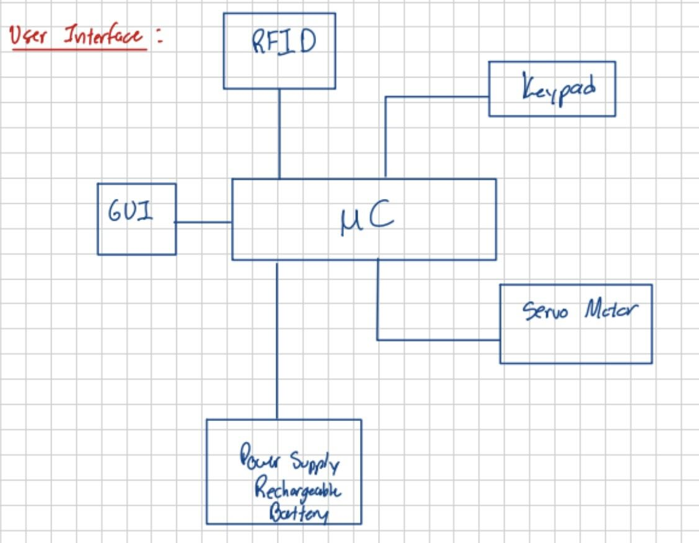

# Design Decisions

This document outlines the major design decisions made by out team during the development of the Smart Deadbolt Lock Project.

---

## Table of Contents
1. Overview
2. High Level Design
3. Hardware Design
4. Software Design
5. Enclosure

---

## 1. Overview
This project is a smart deadbolt lock that provides secure access control, and is built around an Arduino microcontroller to enable access via a keypad and RFID reader. Our team aimed to design a cost-effective, reliable and user-friendly locking mechanism suitable for residential use.

---

## 2. High Level Design

**Block Diagram**

**Decision:** Incorporating RFID 

**Reasoning:** Convenient and safe security measure for modular locking and unlocking system

**Decision:** Incorporating Keypad

**Reasoning:** Efficient alternative to RFID if user doesn't have proper RFID credentials

**Decision:** Incorporating GUI

**Reasoning:** Efficient method of interaction between user and modular system

**Decision:**

**Reasoning:**

---

## 3. Hardware Design

**Decision:** Using Arduino Uno microcrontoller

**Reasoning:** Provides sufficient amount of i/o pins, effective physical size for design

---

## 4. Software Design

**Decision:** 

**Reasoning:** 

---

## 5. Enclosure 

**Decision:**

**Reasoning:**

